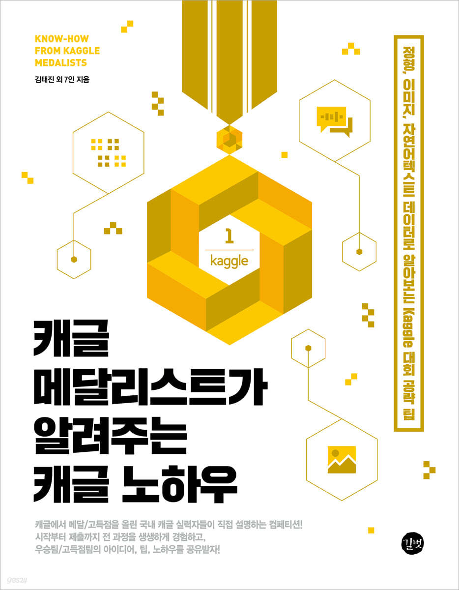

# Kaggle Competition

## Description

본 Kaggle Competition Study는 이미 종료된 대회를 다시 분석하고 뜯어보는 Study입니다. 책에 소개된 커널을 필사했습니다.   
처음에는 하나 하나 이해하며 그대로 필사를 했고, 그 다음은 필사한 코드를 처음부터 다시 쭉 복습을 했고, 마지막으로 처음부터 다시 복습하며 전체적인 흐름을 재차 익혔습니다.  
즉, 하나의 커널당 3번을 분석했습니다.   
Competition 및 커널 필사는 **"캐글 메달리스트가 알려주는 캐글 노하우"** 책을 참고했습니다.

 

---
<!--    1개의 프로젝트 3번 필사, 하루 1번 필사, 
        주마다 2개의 프로젝트
  -->

## Projects 

### Instant Gratification
도메인 지식을 이해하며 문제를 푸는 과정을 배움.

- 김연민_Kaggle Competition Master

  

### Tabular Data
### IEEE-CIS Fraud Detection
도메인 data를 풀어 나가는 정형 데이터 대회

- 김현우_Kaggle Competition Master
- 정성훈_Kaggle Competition Master

  

### Computer Vision
이미지 데이터를 사용한 대회
 

### Quick, Draw! Doodle Recognition

- 명대우_Kaggle Competition Master

### Bengali.AI Handwritten Grapheme Classification

- 이유한_Kaggle Competition Grand Master

### SIIM-ACR Pneumothorax Segmentation

- 권순환_Kaggle Competiton Expert

  

### Natural Language Process
Text 데이터를 활용한 자연어 처리 과정 및 TPU를 사용한 데이터 생성 부터 제출까지의 전과정
 

### Jigsaw Unintended Bias in Toxicity Classification

- 김태진_Kaggle Competition Expert

